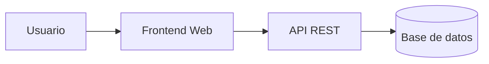

# Sistema de Gestión de Biblioteca


Aplicación web para la gestión eficiente de préstamos, catálogo de libros y usuarios de una biblioteca. Permite optimizar el flujo de trabajo del personal y ofrecer búsquedas rápidas a los lectores.

## Tabla de contenidos

- [Descripción](#descripción)
- [Instalación](#instalación)
- [Uso](#uso)
- [Estado de funcionalidades](#estado-de-funcionalidades)
- [Pendientes](#pendientes)
- [Arquitectura](#arquitectura)
- [Contribuidores](#contribuidores)

## Descripción

Este proyecto documenta y estructura el desarrollo del Sistema de Gestión de Biblioteca. Utiliza una arquitectura moderna basada en microservicios y una interfaz web intuitiva.

## Instalación

```bash
git clone [https://github.com/heraldoochoa-del/laboratorio-readme.git](https://github.com/heraldoochoa-del/laboratorio-readme.git)
cd laboratorio-readme
npm install
```

## Uso

```bash
# Para iniciar la aplicación en modo desarrollo
npm start

# Para ejecutar las pruebas unitarias
npm test
```

## Estado de funcionalidades

| Función | Estado |
|---|---|
| Autenticación de Usuarios | Listo |
| Búsqueda de Libros | Listo |
| Préstamos y Devoluciones | En progreso |
| Reportes Estadísticos | Pendiente |

## Pendientes

- [x] Diseño de la base de datos
- [x] Configuración inicial del repositorio
- [ ] Implementar pasarela de pagos para multas
- [ ] Pruebas unitarias completas

## Arquitectura



## Contribuidores

- **Nombre:** Heraldo Ochoa
- **GitHub:** [@heraldoochoa-del](https://github.com/heraldoochoa-del)


